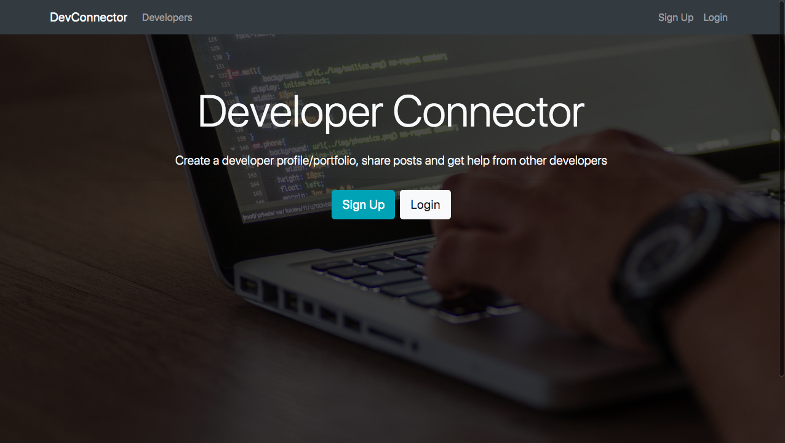

## Dev Connector

A social network for developers who can connect with other developers around the globe, create profiles,share and like blog posts. This app is powered by MongoDB at the backend and React at the frontend.

## App Structure

    .
    ├── client                   # All things frontend.
    ├── config                   # Config files for prod and dev env, keys and passport config.
    ├── models                   # MongoDB models for collections.
    ├── routes                   # Consists of REST routes.
    ├── validation               # Validation helper methods.

## Installing on local

Backend and frontend of the app can both be started at once using the npm package `concurrently`. Just run `npm install` in the root of the app and inside client as well.

## Available Scripts

In the project directory, you can run:

### `npm run dev`

This will start the frontend and backend both.

Runs the app in the development mode. 
Open [http://localhost:3000](http://localhost:3000) to view it in the browser.

### `npm run server`

Starts the backend on nodemon.

### `npm run client`

Starts the react frontend.

### `npm run build`

Creates a production build.
